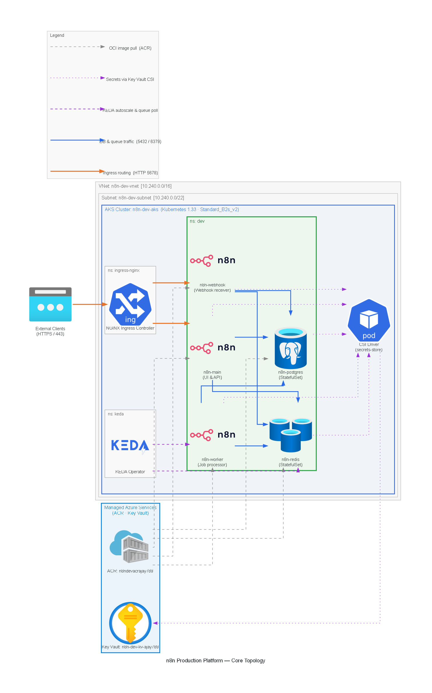

# n8n Production Platform on AKS

A production-grade, self-hosted [n8n](https://n8n.io) deployment on Azure Kubernetes Service, built from scratch as a DevOps portfolio project. This is a **pure infrastructure repository** — zero application code. Everything here is Terraform, Helm, GitOps, and platform operations.

> **What makes this production-grade?** Most self-hosted n8n deployments run as a single container. This platform runs n8n in **queue mode** — three independent process types, autoscaled separately, behind a zero-trust network, with all secrets managed by Azure Key Vault. The same architecture pattern used by teams running n8n at scale.

---

## Architecture



| Component | Role | Scales on |
|---|---|---|
| `n8n-main` | Serves UI, REST API, schedules workflows | API request rate |
| `n8n-webhook` | Receives incoming HTTP webhook triggers | Webhook traffic volume |
| `n8n-worker` | Executes workflows off the Bull queue | Queue depth in Redis (KEDA) |
| `n8n-postgres` | Workflow definitions, credentials, execution history | Storage |
| `n8n-redis` | Bull message queue — broker between main and workers | Memory |

For the full allowed/denied traffic matrix, see [docs/architecture/component-communication.md](docs/architecture/component-communication.md).

---

## Technology Stack

| Layer | Technology |
|---|---|
| **Cloud** | Azure (AKS · ACR · Key Vault · Azure Blob for tfstate) |
| **IaC** | Terraform 1.5.7 with remote state + workspace-based environments |
| **Kubernetes** | AKS 1.33 · Helm (custom chart, written from scratch) · Calico NetworkPolicies |
| **GitOps** | ArgoCD — OCI Helm chart pulled from ACR, automated sync + self-heal |
| **CI/CD** | GitHub Actions with OIDC federation — zero stored secrets |
| **Autoscaling** | KEDA ScaledObject on `bull:jobs:wait` Redis list — 1–10 worker replicas |
| **Observability** | kube-prometheus-stack · custom Grafana dashboard · AlertManager rules |
| **Security** | Azure Key Vault CSI Driver · non-root containers · OPA Gatekeeper |

---

## Repository Structure

```
n8n-production-platform/
├── terraform/
│   ├── modules/          # Reusable modules: aks, acr, keyvault, networking
│   └── env/dev/          # Dev environment: terraform.tfvars, main.tf, backend config
├── helm/n8n/
│   ├── Chart.yaml        # Chart 1.0.0, appVersion 1.94.1
│   ├── values.yaml       # Default values (dev)
│   └── templates/        # 18 templates: deployments, statefulsets, ingress,
│                         # networkpolicies, KEDA ScaledObject, SecretProviderClass
├── gitops/argocd/
│   ├── application.yaml  # ArgoCD Application — OCI source from ACR
│   └── project.yaml      # ArgoCD Project with source/dest restrictions
├── .github/workflows/
│   ├── ci.yaml           # Helm lint → package → push OCI → auto-promote ArgoCD
│   └── infra.yaml        # Terraform plan (PR) / apply (main)
├── monitoring/
│   └── alerts/
│       └── n8n-rules.yaml  # PrometheusRule: failure rate, queue backlog, OOMKill
└── docs/
    └── architecture/
        ├── architecture-diagram.py   # Diagrams-as-code (Python, mingrammer/diagrams)
        ├── architecture-diagram.png  # Rendered topology diagram
        └── component-communication.md # NetworkPolicy allow/deny matrix
```

---

## Infrastructure (Terraform)

The AKS cluster and all supporting Azure resources are provisioned by Terraform. State is stored remotely in Azure Blob Storage.

**Dev environment resources** (`terraform/env/dev/terraform.tfvars`):

| Resource | Name | SKU / Version |
|---|---|---|
| Resource Group | `n8n-dev-rg` | Central India |
| AKS Cluster | `n8n-dev-aks` | Kubernetes 1.33 · Standard_B2s_v2 · 2 nodes |
| VNet | `n8n-dev-vnet` | 10.240.0.0/16 |
| Subnet | `n8n-dev-subnet` | 10.240.0.0/22 |
| Container Registry | `n8ndevacrajay789` | Basic SKU |
| Key Vault | `n8n-dev-kv-ajay789` | Standard SKU |

**Key Terraform features:**
- `SystemAssigned` identity on AKS, with `AcrPull` role assignment for image pulls
- `key_vault_secrets_provider` block with `secret_rotation_enabled = true`
- Calico network policy engine (`network_policy = "calico"`)

```bash
cd terraform/env/dev
terraform init
terraform plan
terraform apply
```

---

## Helm Chart

The custom `helm/n8n` chart (written from scratch) deploys all workloads into the `dev` namespace. There is no upstream chart dependency — every template was authored for this project.

**Workload resource configuration (`values.yaml`):**

| Component | Image | CPU req/limit | Memory req/limit |
|---|---|---|---|
| n8n-main | `n8ndevacrajay789.azurecr.io/n8nio/n8n:1.94.1` | 100m / 300m | 512Mi / 512Mi |
| n8n-webhook | `n8ndevacrajay789.azurecr.io/n8nio/n8n:1.94.1` | 100m / 200m | 128Mi / 256Mi |
| n8n-worker | `n8ndevacrajay789.azurecr.io/n8nio/n8n:1.94.1` | 150m / 400m | 256Mi / 512Mi |
| postgres | `n8ndevacrajay789.azurecr.io/postgres:16.3` | 100m / 200m | 128Mi / 256Mi |
| redis | `n8ndevacrajay789.azurecr.io/redis:7.2.5` | 100m / 200m | 64Mi / 128Mi |

All images are mirrored into ACR — no direct Docker Hub pulls from the cluster.

**Security enforced across every workload:**
- `runAsNonRoot: true`, `runAsUser: 1000`
- `readOnlyRootFilesystem: true`
- `allowPrivilegeEscalation: false`
- `capabilities.drop: [ALL]`
- `seccompProfile: RuntimeDefault`
- Dedicated non-default `ServiceAccount` per component

---

## Secret Management

All runtime secrets (`postgres-password`, `redis-password`, `n8n-encryption-key`) are stored in **Azure Key Vault** and mounted into pods at runtime via the **Secrets Store CSI Driver**. No secret values exist anywhere in this repository.

```
Azure Key Vault
  └── postgres-password  ─┐
  └── redis-password      ├── SecretProviderClass (useVMManagedIdentity: true)
  └── n8n-encryption-key ─┘
        │
        └── Kubernetes Secret: n8n-db-secrets  (mounted into all pods as env vars)
```

Authentication to Key Vault uses a **user-assigned managed identity** attached to the AKS kubelet — no client secrets, no `az login`, no stored credentials.

---

## CI/CD Pipeline

### Helm Chart CI (`ci.yaml`)
Triggered on any push to `helm/n8n/**` on `main`:

```
Push to main
  └─► Helm Lint (strict mode)
  └─► Azure OIDC Login (no stored credentials)
  └─► ACR Login
  └─► Helm Package  →  version: 1.0.0-<git-sha>
  └─► Helm Push OCI →  n8ndevacrajay789.azurecr.io/helm
  └─► Auto-promote  →  sed targetRevision in gitops/argocd/application.yaml
  └─► Git commit + push [skip ci]
```

The `targetRevision` in `application.yaml` is pinned to the **exact immutable chart version** (`1.0.0-<sha>`) by the CI pipeline — no floating semver ranges in production.

### Terraform IaC CD (`infra.yaml`)
Triggered on any push to `terraform/**`:
- **Pull Request**: `terraform plan` (output posted, no apply)
- **Push to main**: `terraform apply -auto-approve`

Both workflows use **OIDC federation** (`id-token: write`) — Azure credentials are never stored as GitHub Secrets.

---

## GitOps (ArgoCD)

ArgoCD pulls the packaged Helm chart from the ACR OCI registry and reconciles continuously:

```yaml
# gitops/argocd/application.yaml (excerpt)
source:
  chart: n8n
  repoURL: n8ndevacrajay789.azurecr.io/helm
  targetRevision: 1.0.0-d78041c   # pinned by CI on every merge
syncPolicy:
  automated:
    prune: true
    selfHeal: true
```

`ignoreDifferences` on `Deployment.spec.replicas` prevents ArgoCD from fighting KEDA's live replica count.

---

## Autoscaling (KEDA)

A KEDA `ScaledObject` watches the `bull:jobs:wait` Redis list and scales `n8n-worker` between **1 and 10 replicas**:

| Parameter | Value |
|---|---|
| Trigger | Redis list `bull:jobs:wait` |
| Scale-up threshold | 5 jobs waiting |
| Min replicas | 1 |
| Max replicas | 10 |
| Cooldown | 300 seconds |

`TriggerAuthentication` reads `redis-password` from the CSI-mounted Kubernetes Secret — KEDA never has raw credential access.

---

## Observability

kube-prometheus-stack is deployed alongside n8n. Three custom `PrometheusRule` alerts are defined in `monitoring/alerts/n8n-rules.yaml`:

| Alert | Condition | Severity |
|---|---|---|
| `N8nHighWorkflowFailureRate` | Failure rate > 10% over 5 min | warning |
| `N8nWorkerQueueBacklog` | > 20 jobs waiting for 5 min | critical |
| `N8nWorkerOOMKill` | Any pod OOMKilled in `dev` namespace | critical |

A custom Grafana dashboard (`helm/n8n/templates/dashboard.yaml`) visualises queue depth, job completion rate, and per-pod memory usage.

---

## Network Security

All inter-pod traffic is **default-deny** via Kubernetes `NetworkPolicy`. Each allowed path is explicitly whitelisted:

| Source | Destination | Port | Reason |
|---|---|---|---|
| `ingress-nginx` | `n8n-main`, `n8n-webhook` | 5678 | UI + webhook ingress |
| `n8n-*` | `n8n-postgres` | 5432 | Workflow persistence |
| `n8n-*` | `n8n-redis` | 6379 | Queue read/write |
| `keda-operator` | `n8n-redis` | 6379 | Queue depth polling |
| All pods | CoreDNS | 53 | Name resolution |
| `n8n-*` | Internet | 443 | Outbound API calls |

Lateral movement between n8n process types (`main` → `worker`, `webhook` → `main`, etc.) is **blocked**. The Ingress controller cannot reach Postgres or Redis directly.

See [docs/architecture/component-communication.md](docs/architecture/component-communication.md) for the complete matrix.

---

## Non-Negotiables

These rules are enforced across every file in this repository:

1. **No secrets in Git.** No exceptions. All credentials via Key Vault CSI.
2. **No `:latest` image tags.** Every image pinned to a specific semver digest.
3. **Every container has resource requests AND limits.**
4. **Every Deployment has liveness and readiness probes.**
5. **No pod uses the `default` ServiceAccount.**
6. **NetworkPolicies: default-deny namespace, then explicit whitelist.**
7. **All cluster changes go through Git → ArgoCD.** No manual `kubectl apply` to prod.