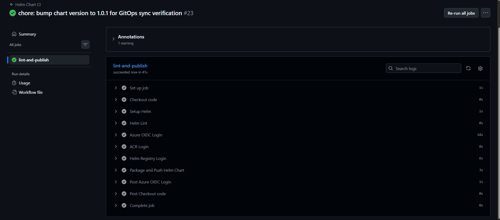
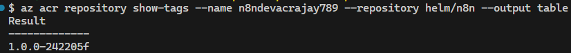
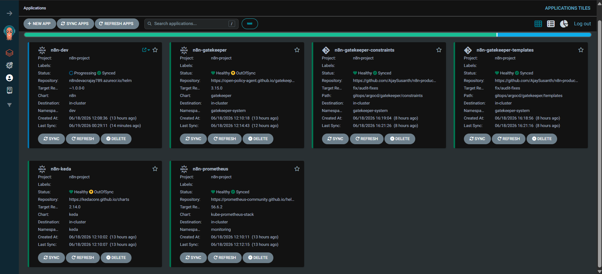
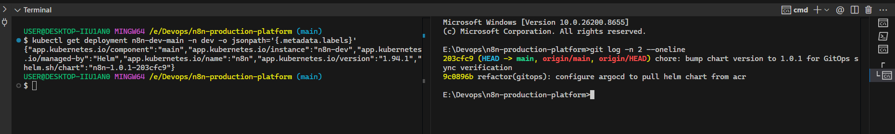
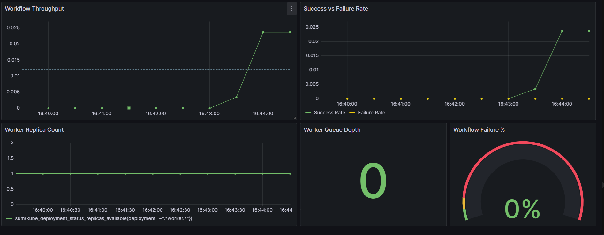
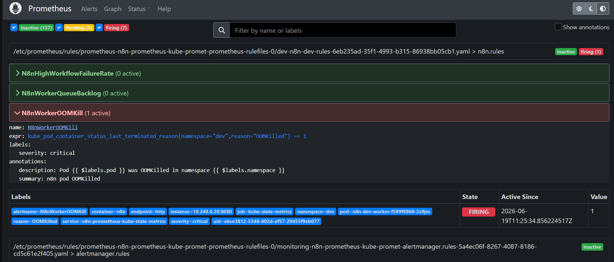
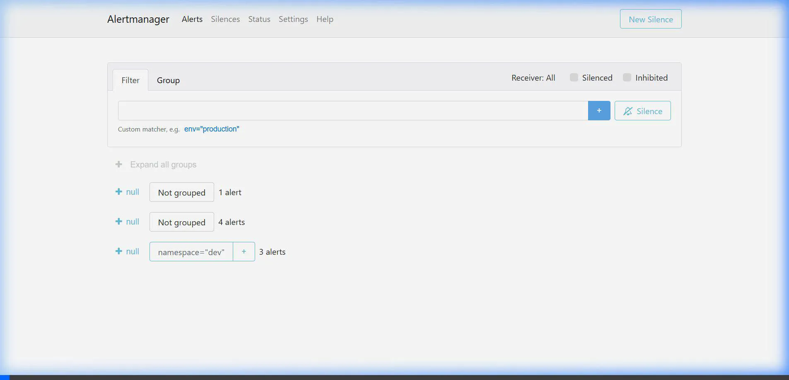
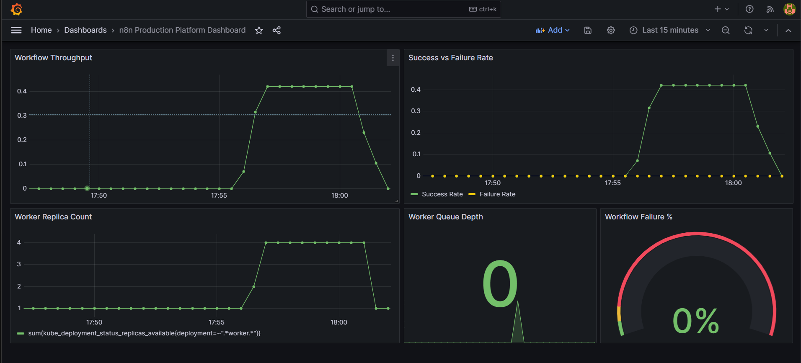
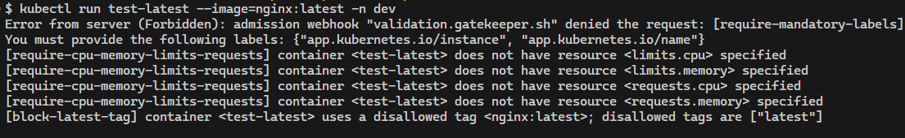
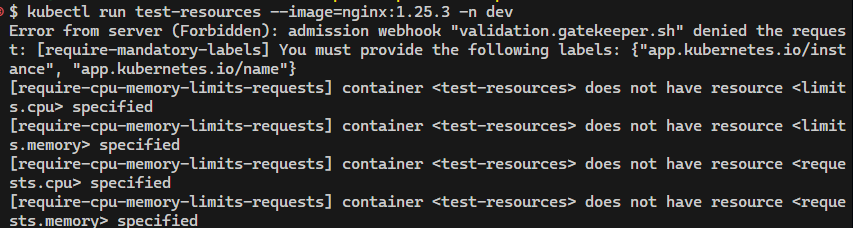

# Verification Evidence Ledger
 
This ledger tracks verification status and evidence for the n8n AKS production platform. Every non-negotiable from the project's engineering constraints is checked here — with a real command output or a screenshot of the observable outcome.
 
## Evidence Strategy
 
Two verification types are used deliberately:
 
- **Command output** — for static configuration state: what is deployed, how it is configured, which permissions are granted. Every output here was captured live from the running cluster.
- **Screenshot** — reserved for enforcement boundaries and dynamic behaviors: what the system *refuses* to do, what it *does automatically* under load, and what fires when something goes wrong.
Checks that are satisfied by the Helm chart source (resource limits, probes, ServiceAccounts) are cross-referenced against live pod state — config in YAML means nothing if the running pod doesn't reflect it.
 
---
 
## Master Summary Table
 
| Phase | Check | Status | Type | Evidence |
| :--- | :--- | :--- | :--- | :--- |
| **Phase 2** | All pods: named ServiceAccount | **PASS** | Command output | [§2.1](#21-workload-security-compliance) |
| **Phase 2** | All pods: resource limits enforced | **PASS** | Command output | [§2.1](#21-workload-security-compliance) |
| **Phase 2** | All pods: hardened securityContext | **PASS** | Command output | [§2.2](#22-container-security-context) |
| **Phase 2** | Key Vault: kubelet identity — Get only | **PASS** | Command output | [§2.3](#23-key-vault-least-privilege-access) |
| **Phase 2** | Secrets: no committed credentials in cluster | **PASS** | Command output | [§2.4](#24-secrets-isolation) |
| **Phase 2** | KEDA ScaledObject: live and watching correct metric | **PASS** | Command output | [§2.5](#25-keda-scaledobject-state) |
| **Phase 2** | NetPol: `worker → main` blocked | **PASS** | Command output | [§2.6](#26-networkpolicy-enforcement) |
| **Phase 2** | NetPol: `worker → webhook` blocked | **PASS** | Command output | [§2.6](#26-networkpolicy-enforcement) |
| **Phase 3** | CI: lint → package → OCI push via OIDC | **PASS** | Screenshot | [§3.1](#31-github-actions-ci-pipeline) |
| **Phase 3** | Helm chart tagged by commit SHA in ACR | **PASS** | Screenshot | [§3.2](#32-helm-chart-in-acr-oci-registry) |
| **Phase 3** | ArgoCD sourcing from ACR OCI registry | **PASS** | Screenshot | [§3.3](#33-argocd-oci-source) |
| **Phase 3** | ArgoCD synced to exact commit SHA | **PASS** | Screenshot | [§3.4](#34-gitops-sync-reconciliation) |
| **Phase 4** | Custom Grafana dashboard: application metrics | **PASS** | Screenshot | [§4.1](#41-custom-grafana-dashboard) |
| **Phase 4** | Custom AlertManager rule: OOMKill fires end-to-end | **PASS** | Screenshot | [§4.2](#42-oomkill-alert-end-to-end) |
| **Phase 4** | KEDA: workers scale 1→4 under Redis queue load | **PASS** | Screenshot | [§4.3](#43-keda-autoscaling-under-load) |
| **Phase 5** | Gatekeeper blocks `:latest` image tags | **PASS** | Screenshot | [§5.1](#51-opa-gatekeeper-admission-enforcement) |
| **Phase 5** | Gatekeeper blocks pods without resource limits | **PASS** | Screenshot | [§5.1](#51-opa-gatekeeper-admission-enforcement) |
 
---
 
## Phase 2 — Workload Configuration and Network Enforcement
 
### 2.1 Workload Security Compliance
 
Verifies two non-negotiables in a single live query: named ServiceAccounts, and resource limits across every running pod. The column queries live pod state — not the Helm values file.
 
```
$ kubectl get pods -n dev \
  -o custom-columns='NAME:.metadata.name,SA:.spec.serviceAccountName,LIMITS:.spec.containers[*].resources.limits'
 
NAME                               SA                 LIMITS
n8n-dev-main-854f9967f8-9khw5      n8n-dev-main       map[cpu:300m memory:512Mi]
n8n-dev-postgres-0                 n8n-dev-postgres   map[cpu:200m memory:256Mi]
n8n-dev-redis-0                    n8n-dev-redis      map[cpu:200m memory:128Mi],map[cpu:100m memory:128Mi]
n8n-dev-webhook-7c68f6b4f8-2m9g5   n8n-dev-webhook    map[cpu:200m memory:256Mi]
n8n-dev-worker-7dd9c59b45-lxs98    n8n-dev-worker     map[cpu:400m memory:512Mi]
```
 
### 2.2 Container Security Context
 
Verifies the full hardened securityContext on a representative pod.
 
```
$ kubectl get pod n8n-dev-main-854f9967f8-9khw5 -n dev \
  -o jsonpath='{.spec.containers[0].securityContext}'
 
{
  "allowPrivilegeEscalation": false,
  "capabilities": { "drop": ["ALL"] },
  "readOnlyRootFilesystem": true,
  "runAsGroup": 1000,
  "runAsNonRoot": true,
  "runAsUser": 1000
}
```
 
All six fields are set: `runAsNonRoot`, `runAsUser`, `runAsGroup`, `readOnlyRootFilesystem`, `allowPrivilegeEscalation: false`, and `capabilities.drop: ALL`. This is the complete hardened profile — not just the minimum required.
 
Each workload defines its `securityContext` inline in its own deployment template. Postgres intentionally uses `runAsUser: 999 / runAsGroup: 999` — the official postgres system UID — while all n8n process types (`main`, `webhook`, `worker`) use `runAsUser: 1000`. The profiles are consistent in structure but not identical, which is correct: forcing UID 1000 on the postgres container would conflict with the image's expected user and cause startup failures.
 
### 2.3 Key Vault Least-Privilege Access
 
Two identities have Key Vault access. The AKS kubelet identity — the one that mounts secrets into pods at runtime — has `Get` only. The provisioning identity (GitHub Actions OIDC service principal) has broader write access for initial secret creation during infrastructure setup. These are intentionally separate concerns.
 
```
$ az keyvault show \
  --name n8n-dev-kv-ajay789 \
  --query "properties.accessPolicies[].{ObjectId:objectId,Permissions:permissions.secrets}" \
  -o json
 
[
  {
    "ObjectId": "fc0a3b54-d9a8-41ae-8994-9b2a68fcb539",   ← GitHub Actions OIDC SP
    "Permissions": ["Get", "List", "Set", "Delete", "Purge", "Recover"]
  },
  {
    "ObjectId": "0b4f4579-ff47-48f7-9752-a26dbd343133",   ← AKS kubelet identity
    "Permissions": ["Get"]
  }
]
 
$ az aks show \
  --resource-group n8n-dev-rg \
  --name n8n-dev-aks \
  --query "identityProfile.kubeletidentity.objectId" \
  -o tsv
 
0b4f4579-ff47-48f7-9752-a26dbd343133
```
 
The kubelet object ID matches the identity with `Get` only — confirmed least-privilege. The runtime secret mount path never has write access to Key Vault.
 
### 2.4 Secrets Isolation
 
```
$ kubectl get secrets -n dev
 
NAME                 TYPE     DATA   AGE
n8n-dev-db-secrets   Opaque   3      36h
```
 
One secret, three keys (`postgres-password`, `redis-password`, `n8n-encryption-key`). There are no developer-committed Secret manifests anywhere in this repository. `n8n-dev-db-secrets` is created at runtime by the Secrets Store CSI Driver — the `SecretProviderClass` defines a `secretObjects:` block that instructs the driver to project the Key Vault values into a standard Kubernetes Secret in etcd. AKS encrypts etcd at rest, so the secret is not stored as plaintext, but it does exist in etcd as an encrypted object. The source of truth remains Azure Key Vault — if the Key Vault values are rotated, the CSI driver updates the projection on the next sync cycle without any Git commit or redeployment required.
 
### 2.5 KEDA ScaledObject State
 
```
$ kubectl get scaledobject -n dev -o wide
 
NAME             SCALETARGETKIND      SCALETARGETNAME   MIN   MAX   TRIGGERS   AUTHENTICATION              READY   ACTIVE   FALLBACK   PAUSED    AGE
n8n-dev-worker   apps/v1.Deployment   n8n-dev-worker    1     10    redis      n8n-dev-worker-redis-auth   True    False    False      Unknown   36h
```
 
The ScaledObject is `READY: True` — KEDA has validated the trigger configuration and can reach the Redis metric source. `ACTIVE: False` indicates no jobs are currently waiting in the queue (expected at idle). `FALLBACK: False` confirms KEDA is reading the metric successfully — fallback only activates when the metric source is unreachable. Dynamic scaling evidence under load is in §4.3.
 
> **Note on `PAUSED: Unknown`:** This is normal on KEDA versions that report pause state only when explicitly set. It does not indicate a problem.
 
### 2.6 NetworkPolicy Enforcement
 
The namespace runs default-deny. These two tests verify the deny policy is active by attempting connections across paths with no explicit whitelist entry — executed from inside running pods using `nc` (netcat).
 
> **Note on test case selection:** An earlier test attempt used `webhook → postgres` as the second blocked path. That connection was open — correctly so, because the `allow-db-ingress` NetworkPolicy explicitly whitelists `webhook` to Postgres on port 5432. n8n's webhook process queries Postgres on startup to load active trigger registrations. This is an intentional allowed path, not a gap. The tests below were chosen by reading the actual NetworkPolicy manifests to identify paths with no whitelist entry.
 
**Test 1: `worker → main` (blocked — no whitelist entry)**
 
Workers consume jobs from the Redis queue and execute workflows. They have no architectural reason to call the Main API pod directly. If this path were open, a compromised worker could manipulate workflow definitions or read credentials through the n8n REST API.
 
```
$ kubectl exec -n dev deploy/n8n-dev-worker -- \
    nc -zv n8n-dev-main 5678 -w 5
 
nc: n8n-dev-main (10.0.200.132:5678): Operation timed out
command terminated with exit code 1
```
 
**Test 2: `worker → webhook` (blocked — no whitelist entry)**
 
Workers have no reason to send traffic to the webhook receiver. Webhook pods are the most externally-exposed process type — blocking inbound connections from other internal components limits the blast radius if a worker pod is compromised.
 
```
$ kubectl exec -n dev deploy/n8n-dev-worker -- \
    nc -zv n8n-dev-webhook 5678 -w 5
 
nc: n8n-dev-webhook (10.0.224.242:5678): Operation timed out
command terminated with exit code 1
```
 
Both connections time out — packets are silently dropped by the default-deny policy rather than actively refused. A `Connection refused` response would indicate the application rejected the connection; a timeout indicates the NetworkPolicy dropped it at the network layer before it reached the pod.
 
---
 
## Phase 3 — CI/CD Pipeline and GitOps
 
### 3.1 GitHub Actions CI Pipeline
 
The CI workflow (`ci.yaml`) triggers on every push to `helm/n8n/**`. It lints the chart in strict mode, authenticates to Azure via OIDC token exchange (no stored credentials), packages the chart versioned as `1.0.0-<git-sha>`, pushes it to ACR as an OCI artifact, then patches `targetRevision` in the ArgoCD application manifest — triggering the GitOps reconciliation loop automatically. No human step exists between a merged PR and a running cluster change.
 

 
### 3.2 Helm Chart in ACR OCI Registry
 
The chart is stored in ACR tagged with the exact commit SHA. Every chart version is immutable and traceable to a specific Git commit — the same principle as pinning container image digests. There are no floating version ranges.
 

 
### 3.3 ArgoCD OCI Source
 
Most ArgoCD tutorials source Helm charts from HTTP repositories. This platform sources from an ACR OCI registry using a scoped read-only token (`argocd-helm-pull`). The screenshot shows ArgoCD successfully resolving chart parameters directly from the OCI artifact in ACR.
 

 
### 3.4 GitOps Sync Reconciliation
 
ArgoCD continuously reconciles the cluster state against the chart version pinned in `application.yaml`. The commit SHA shown in the ArgoCD UI matches the Git commit that triggered the CI run — the full loop is closed: Git commit → CI packages chart → ArgoCD syncs cluster.
 

 
---
 
## Phase 4 — Observability and Autoscaling
 
### 4.1 Custom Grafana Dashboard
 
This dashboard was written from scratch — it is not one of the pre-built dashboards that ship with kube-prometheus-stack. It surfaces application-level signals: workflow execution throughput, success/failure rate, Redis queue depth, and active worker replica count. These are the metrics that indicate whether n8n is working correctly, not just whether the underlying Kubernetes nodes are healthy.
 

 
### 4.2 OOMKill Alert End-to-End
 
To verify the `N8nWorkerOOMKill` PrometheusRule works end-to-end, a worker pod's memory limit was deliberately set to 15Mi — low enough to trigger an OOM kill under normal operation. The alert transitioned to `FIRING` in the Prometheus UI and the notification payload appeared in AlertManager.
 
This tests the complete alerting pipeline: metric collection → PromQL rule evaluation → alert state transition → AlertManager notification routing. A rule that exists in YAML but has never been observed firing is unverified.
 


 
### 4.3 KEDA Autoscaling Under Load
 
A burst of webhook requests was sent to populate `bull:jobs:wait` beyond the configured threshold of 5 jobs. KEDA detected the queue depth via its `TriggerAuthentication`-secured Redis connection and scaled `n8n-dev-worker` from 1 to 4 replicas. After the 300-second cooldown period, replicas returned to the minimum of 1.
 
This is the core architectural proof of queue mode: under load, only the worker tier scaled — main and webhook pods were unaffected.
 

 
---
 
## Phase 5 — Admission Control
 
### 5.1 OPA Gatekeeper Admission Enforcement
 
Gatekeeper runs as a validating admission webhook. Resource creation requests that violate a `ConstraintTemplate` policy are rejected at the Kubernetes API server before the object is persisted — the workload never starts.
 
The Helm chart already enforces limits and pinned tags on every n8n workload. Gatekeeper enforces the same rules at the cluster level — meaning no deployment, by any method (manual `kubectl apply`, a misconfigured CI job, a future chart change by a different author), can bypass the constraint. The policy is enforced at the control plane, not just at authoring time.
 
**Test 1: `:latest` image tag rejected**
 
A test deployment using `nginx:latest` was submitted to the `dev` namespace. Gatekeeper's `DisallowedTags` constraint rejected it at admission with an explicit policy violation message — the object was never created.
 

 
**Test 2: Missing resource limits rejected**
 
A test pod without `resources.limits` defined was submitted. Gatekeeper's `require-cpu-memory-limits-requests` constraint (`K8sRequiredResources`) rejected it before the scheduler could place it on a node.
 
